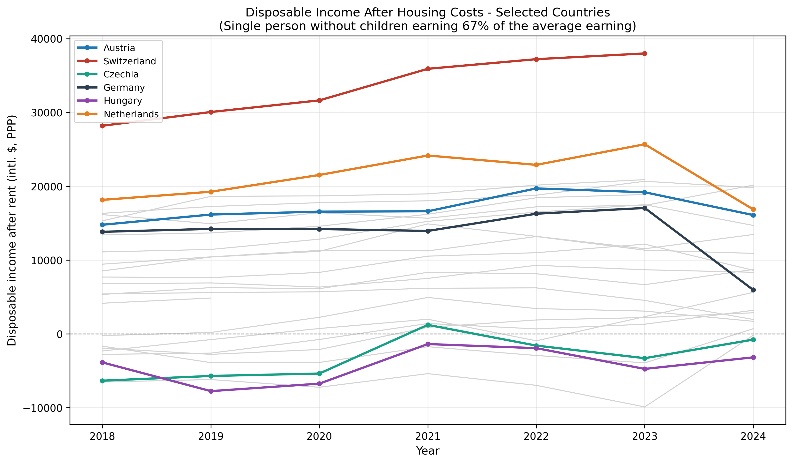
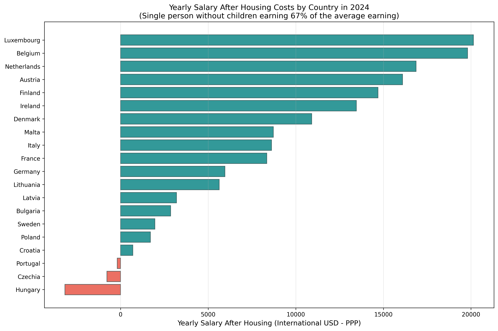

# Management Summary

**Verfügbares Einkommen nach Wohnkosten im europäischen Vergleich (2018–2024)**

*Fragestellung: Wie viel bleibt einer alleinstehenden Person mit 67 % des Durchschnittseinkommens nach Abzug der Miete für eine 1-Zimmer-Wohnung in der Hauptstadt übrig — kaufkraftbereinigt (KKP), über 24 europäische Länder?*

Datengrundlage: Eurostat (Nettoeinkommen, Mieten), Weltbank (KKP-Faktoren), EZB (Wechselkurse). Vollständige Methodik und Einschränkungen: siehe [README](README.md).

---

## Kernaussagen

**1. Die Schweiz liegt mit großem Abstand vorn.** Rund **33.500 intl. $** pro Jahr bleiben nach Wohnkosten (Ø 2018–2023) — etwa 58 % mehr als beim Zweitplatzierten Niederlande (≈ 21.200 intl. $). Es folgen Island (≈ 18.800) und Belgien (≈ 18.400).

**2. Österreich rangiert auf Platz 5 von 24** mit durchschnittlich **≈ 17.000 intl. $** pro Jahr — stabil über den gesamten Zeitraum und vor Deutschland (≈ 13.600, Platz 9).

**3. In vier Ländern übersteigt die Hauptstadtmiete das Nettoeinkommen dieser Einkommensgruppe.** In Kroatien, Tschechien, Ungarn und Portugal ist der Saldo negativ (bis zu **−6.100 intl. $** in Portugal): Eine 1-Zimmer-Wohnung in der Hauptstadt ist aus 67 % des Durchschnittseinkommens allein nicht finanzierbar.

**4. Datenrevisionen 2024 verändern das Bild spürbar.** Eurostat hat die 2024er-Werte für die Niederlande und Deutschland nach unten revidiert (Flag „b" — Bruch in der Zeitreihe, im Chart als Knick sichtbar); der Schweizer Wert 2024 wurde vollständig zurückgezogen. Solche Revisionen sind ein zentrales Plausibilisierungs-Thema bei der Arbeit mit amtlichen Statistiken.

---

## Entwicklung ausgewählter Länder

*Farbig: ausgewählte Länder inkl. Österreich; grau: übrige 18 Länder als Kontext. Gestrichelte Linie = Nullsaldo.*

## Ländervergleich 2024

---

*Alle Werte in internationalen Dollar (KKP-bereinigt), Einkommensfall „Single ohne Kinder, 67 % des Durchschnittseinkommens". Details, CSV-Ergebnisse und ein formatierter Excel-Report (`output/salary_report.xlsx`) lassen sich mit einem Befehl reproduzieren: `python analysis.py --case 6 --start-year 2018 --save-plots --excel`.*
