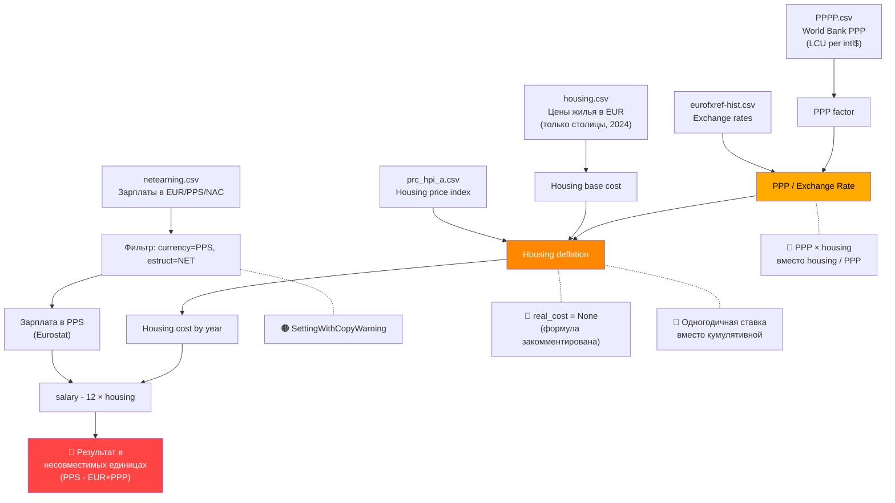

# 🔍 Экспертная Оценка Проекта: European Salary Analysis

> **Роль рецензента**: Data Science Engineer  
> **Файл**: [2.py](file:///Users/boxyk/vs/2.py)  
> **Фокус**: Ошибки логики и кода (не рекомендации по улучшению)

---

## Сводка найденных ошибок

| Категория | Критичность | Кол-во |
|-----------|-------------|--------|
| 🔴 Критические ошибки расчётов | Результаты неверны | 5 |
| 🟠 Ошибки в коде | Код ломается / undefined behavior | 4 |
| 🟡 Статистические ошибки | Неверная интерпретация | 3 |
| 🔵 Проблемы с данными | Потеря/искажение данных | 3 |

---

## 🔴 Критические ошибки расчётов

### 1. Несовместимость единиц измерения: зарплата vs жильё

> [!CAUTION]
> Это самая фундаментальная ошибка проекта. Все итоговые результаты невалидны из-за неё.

**Где**: [строки 43, 209, 250](file:///Users/boxyk/vs/2.py#L43-L250)

Зарплата фильтруется с `currency='PPS'` (строка 43), что означает — значения уже переведены в **Eurostat Purchasing Power Standard**. Затем стоимость жилья конвертируется через **World Bank GDP PPP factor** (строки 209, 250).

**Проблема**: Eurostat PPS и World Bank PPP — это **две разные системы измерения**:
- **Eurostat PPS** основан на Comparative Price Levels (CPL) Евростата
- **World Bank PPP** — это `PA.NUS.PPP` (LCU per international $), основан на ICP

Вычитать одно из другого — это как вычитать килограммы из фунтов. Результат бессмыслен.

**Пример**:
```
Австрия 2024, single 67%:
  Зарплата PPS = 27,150 PPS (Eurostat)
  Жильё = 1200 EUR × 0.733 (World Bank PPP) = 879.6 (??? единицы)
  Результат = 27,150 - 12×879.6 = 16,595 (PPS - 12×EUR×PPP???)
```

---

### 2. PPP конвертация в неправильном направлении

**Где**: [строка 209](file:///Users/boxyk/vs/2.py#L209) и [строка 97-98](file:///Users/boxyk/vs/2.py#L97-L98)

```python
# Строка 209:
merged_df['cost_of_housing_ppp'] = merged_df['Стоимость'] * merged_df['2024']
```

PPP conversion factor = `LCU per international $`. Чтобы конвертировать **из** LCU **в** international $:

```
international$ = LCU / PPP_factor
```

Код делает **умножение** вместо **деления**:

| | Код (умножение) | Правильно (деление) |
|---|---|---|
| Вена (1200 EUR, PPP=0.733) | 1200 × 0.733 = **879 €** | 1200 / 0.733 = **1,636 intl$** |
| Цюрих (2570 EUR, PPP≈1.0) | 2570 × 1.0 = **2,570 €** | 2570 / 1.0 = **2,570 intl$** |

**Последствие**: Жильё в странах с PPP < 1 (большинство ЕС) **занижается** ≈ на 30-40%. Это систематически искажает рейтинг стран.

---

### 3. Housing deflation: используется годовая ставка вместо кумулятивной

**Где**: [строки 160-185](file:///Users/boxyk/vs/2.py#L160-L185) (функция `housing_cost_by_year`)

Код вычисляет `rate_yc` как кумулятивный рост цен от `year` до 2024:
```python
for y in range(year, 2024):
    rate_yc *= ((100 + float(geo_changes[...]['OBS_VALUE'])) / 100)
```

Но `rate_yc` **нигде не используется** (формула закомментирована на строках 166-183), а `real_cost` остаётся `None`.

Анализ сохранённого [housing_by_year.csv](file:///Users/boxyk/vs/housing_by_year.csv) показывает, что он был сгенерирован **предыдущей версией кода**, которая использовала только **одногодичную ставку** вместо кумулятивной:

```
Формула в CSV:  cost = base_2024 × PPP / (1 + rate_за_год/100)
Правильная:     cost = base_2024 × PPP / cumulative_rate_от_года_до_2024
```

**Доказательство**:
```
AUT CH2018 в CSV = 866.49
1200 × 0.765 / 1.06 = 866.49  ← одногодичная ставка ✓
1200 × 0.765 / 1.459 = 629.33 ← кумулятивная ставка ✗ (не совпадает)
```

---

### 4. Текущий код `housing_cost_by_year` сломан — `real_cost` = `None`

**Где**: [строки 154-185](file:///Users/boxyk/vs/2.py#L154-L185)

```python
# Строка 154-156: обработка года 2024
if year == 2024:
    real_cost = costfor2024 * float(ppp_value)  # ppp_value от ПРЕДЫДУЩЕГО года!
    break

# Строка 158-160: обработка других годов
year_key = str(year)
ppp_value = ppp_by_country.loc[geo3, year_key]
real_cost = None  # ← Никогда не переприсваивается!

# Строки 166-183: формула ЗАКОММЕНТИРОВАНА

# Строка 185:
housing_by_country[f'CH{year}'] = real_cost  # ← ЗАПИСЫВАЕТ None!
```

**Три бага в одном блоке**:
1. Для годов ≠ 2024: `real_cost` остаётся `None` (формула закомментирована)
2. Для года 2024: `ppp_value` берётся из **предыдущей** итерации (от 2023 года), не от 2024
3. `rate_yc` вычисляется, но нигде не используется

---

### 5. `countries2024()` не вызывается нигде

**Где**: [строки 198-225](file:///Users/boxyk/vs/2.py#L198-L225)

Функция `countries2024()` определена, но **никогда не вызывается** в `main`. Весь пайплайн идёт:
```
main → custom_countries → housing_cost_by_year → countries18_24
```

Функция `countries2024` — мёртвый код.

---

## 🟠 Ошибки в коде

### 6. `SettingWithCopyWarning` — неопределённое поведение

**Где**: [строка 51](file:///Users/boxyk/vs/2.py#L51)

```python
countries = df[(df['currency']=='PPS') & (df['estruct']=='NET')]  # view или copy?
countries['Country Code'] = countries['geo'].map(country_mapping)  # SettingWithCopyWarning!
```

Pandas не гарантирует, вернёт ли фильтрация view или copy. Присвоение нового столбца к view может:
- Молча не сработать
- Модифицировать оригинальный `df`
- Вызвать `SettingWithCopyWarning`

**Подтверждено тестированием**: Warning срабатывает.

---

### 7. Мутация глобальных переменных в `custom_countries()`

**Где**: [строки 299-311](file:///Users/boxyk/vs/2.py#L299-L311)

```python
def custom_countries(choiced_case_earning, time_period):
    global countries     # мутирует глобальный DataFrame
    global cleanppp      # мутирует глобальный DataFrame
    
    countries = countries.drop([...], axis=1)       # удаляет столбцы навсегда
    cleanppp = cleanppp.drop(str(i), axis=1)        # удаляет столбцы навсегда
```

После вызова `custom_countries()`, глобальные `countries` и `cleanppp` **необратимо изменены**. Если бы код вызывался повторно (например, в интерактивном режиме), он бы крашился на попытке удалить уже удалённые столбцы.

Аналогично в [строках 235-236](file:///Users/boxyk/vs/2.py#L235-L236) функция `countries18_24` тоже использует `global`.

---

### 8. Отсутствие обработки пропущенных значений в housing index

**Где**: [строка 163](file:///Users/boxyk/vs/2.py#L163)

```python
rate_yc *= ((100 + float(geo_changes[geo_changes['TIME_PERIOD'] == y]['OBS_VALUE'].values[0])) / 100)
```

Если для какого-то года нет данных по housing price index, `values[0]` вызовет `IndexError`. Это реальная проблема — например, для Хорватии (HRV) данные заканчиваются раньше:

```
HRV: CH2023 = NaN, CH2024 = NaN (подтверждено в housing_by_year.csv)
```

---

### 9. Литва, Латвия, Мальта, Великобритания — пропущены после exchange rate adjustment

**Где**: [строки 88-101](file:///Users/boxyk/vs/2.py#L88-L101)

Для стран, чьи валюты исчезли (LTL → EUR в 2015, LVL → EUR в 2014, MTL → EUR в 2008):
- Exchange rate данные заканчиваются в год перехода на EUR
- PPP делится на exchange rate только для тех лет, где есть курс
- Для последующих лет PPP **не корректируется** — остаётся в LCU (которой больше не существует)

Результат в [housing_by_year.csv](file:///Users/boxyk/vs/housing_by_year.csv):
```
LTU: NaN NaN NaN NaN NaN NaN NaN
LVA: NaN NaN NaN NaN NaN NaN NaN
GBR: NaN NaN NaN NaN NaN NaN NaN
```

Мальта (MLT) отсутствует в housing.csv.

---

## 🟡 Статистические ошибки

### 10. Неправильный расчёт доверительного интервала

**Где**: [строка 281](file:///Users/boxyk/vs/2.py#L281)

```python
margin_of_error = 1.96 * std_values / np.sqrt(len(merged_df['TIME_PERIOD'].unique()))
```

**Ошибка 1**: Знаменатель должен быть √N **для каждой группы (страны)**, а не общее количество уникальных лет. Код использует `len(merged_df['TIME_PERIOD'].unique())` = 7, но:
- GBR имеет только 2 точки данных (2018-2019)
- Все остальные имеют 7

Правильно:
```python
counts = grouped.count()
margin_of_error = 1.96 * std_values / np.sqrt(counts)
```

**Ошибка 2**: При N=7 наблюдений нужно использовать t-распределение (`t.ppf(0.975, df=N-1)`), а не z=1.96. Разница при N=7: t₀.₉₇₅(6) = 2.447 vs z = 1.96 — занижение CI на ~20%.

---

### 11. T-test на временных рядах — нарушение предпосылок

**Где**: [строки 314-350](file:///Users/boxyk/vs/2.py#L314-L350)

`stats.ttest_ind()` предполагает **независимые** выборки. Данные за 2018-2024 — это **временной ряд** с автокорреляцией (зарплаты и цены на жильё коррелируют год-к-году).

**Последствия**:
- P-value будет **заниженным** (ложный вывод о значимости)
- Эффективный размер выборки меньше N=7 из-за автокорреляции
- При N=7 t-test имеет крайне низкую статистическую мощность

---

### 12. Confidence Interval на графике — неверная интерпретация

**Где**: [строки 276-289](file:///Users/boxyk/vs/2.py#L276-L289)

CI рассчитывается от **среднего по годам** за 2018-2024 для каждой страны. Но:
- Это **не** доверительный интервал для "истинного" disposable income
- Данные не являются случайной выборкой — это полная генеральная совокупность за эти годы
- CI предполагает, что данные — случайная выборка из некой популяции, но тут каждая точка — конкретный год

---

## 🔵 Проблемы с данными

### 13. Housing data — только столицы, но используется для всей страны

**Где**: [housing.csv](file:///Users/boxyk/vs/housing.csv)

Стоимость жилья взята для **одного города** (обычно столицы):
- Берлин (1220 EUR) представляет всю Германию
- Вена (1200 EUR) представляет всю Австрию
- Цюрих (2570 EUR) представляет всю Швейцарию

Зарплата же — **средняя по стране**. Сравнение столичных цен с общенациональной зарплатой создаёт систематическое смещение **против** стран с дорогими столицами.

---

### 14. Housing базовая стоимость привязана к 2024 году — нет источника

Стоимость жилья в [housing.csv](file:///Users/boxyk/vs/housing.csv) — статичные числа, предположительно за 2024 год. Но:
- Нет указания источника (Numbeo? Idealista? Immowelt?)
- Нет даты сбора данных
- Цены для ретроспективных расчётов (2018-2023) получаются дефляцией **одного** числа

---

### 15. Мальта (MLT) включена в country_mapping но отсутствует в housing.csv

**Где**: [строки 18-22](file:///Users/boxyk/vs/2.py#L18-L22) vs [housing.csv](file:///Users/boxyk/vs/housing.csv)

`country_mapping` содержит `'MT': 'MLT'`, но в housing.csv нет строки для Мальты. Код обрабатывает это молча (через `continue` на строке 145-146), но пользователь не информируется о пропущенной стране.

---

## Дополнительные мелкие баги

### 16. `countries_18_24` — неиспользуемая переменная
**Где**: [строка 55](file:///Users/boxyk/vs/2.py#L55)
```python
countries_18_24 = countries[(countries['TIME_PERIOD'] >=2018)&(countries['geo'].isin(["AT","DE","NL","CH"]))]
```
Эта переменная создаётся но **нигде не используется**.

### 17. `Unnamed: 42` столбец в exchange_rate — не обработан
Файл eurofxref-hist.csv содержит trailing comma, создающую пустой столбец `Unnamed: 42`. Он попадает в `groupby('Year').mean()` без ошибки, но присутствует в промежуточных данных.

### 18. Двойная загрузка CSV в t_test()
**Где**: [строки 323-324](file:///Users/boxyk/vs/2.py#L323-L324)
```python
t_test_msh1 = pd.read_csv('countries.csv')
t_test_msh2 = pd.read_csv('countries.csv')  # тот же файл загружен дважды!
```

### 19. `drop(1999, axis=1)` без проверки
**Где**: [строка 85](file:///Users/boxyk/vs/2.py#L85)
Если 1999 год отсутствует в данных, код крашнется с `KeyError`.

---

## Схема потока данных с отмеченными ошибками



---

## Итоговая оценка

| Аспект | Оценка |
|--------|--------|
| Идея проекта | ✅ Хорошая и практически полезная |
| Сбор данных | ⚠️ Приемлемо, но housing данные слабые |
| Обработка данных | ❌ Фундаментальные ошибки в PPP конвертации |
| Математическая корректность | ❌ Несовместимые единицы, неправильная дефляция |
| Статистический анализ | ❌ Нарушены предпосылки тестов |
| Код | ⚠️ Работает, но с warnings и мёртвым кодом |
| Воспроизводимость | ❌ Текущий код генерирует None вместо значений |

> [!IMPORTANT]
> **Главный вывод**: Все числовые результаты проекта невалидны из-за ошибки #1 (смешивание Eurostat PPS с World Bank PPP) и ошибки #2 (неправильное направление PPP конвертации). Даже если исправить код, результаты будут неверны без перехода на единую систему PPP.
